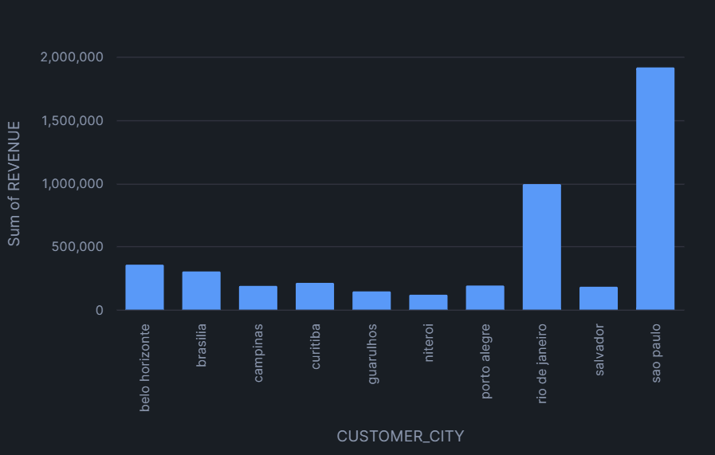
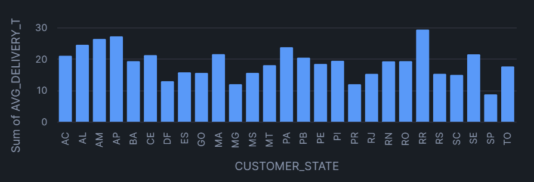
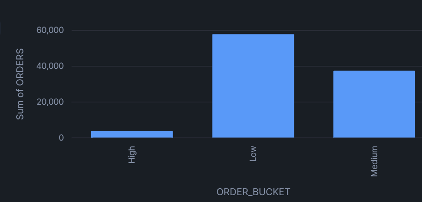
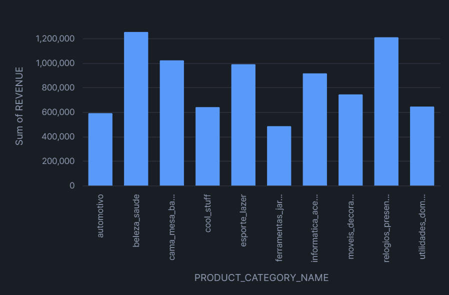

# 🛒 E-commerce ELT Pipeline | Snowflake, dbt, SQL

## 📌 Overview

This project builds a modern **ELT pipeline** using **Snowflake** and **dbt** to transform raw e-commerce data into a **business-ready analytical model**.

The goal is to analyze:

* Revenue drivers
* Delivery performance
* Customer behavior
* Payment patterns

---

## 🏗️ Architecture

```
Raw (Snowflake) → Staging (dbt) → Intermediate → Fact & Dimension → Analysis
```

### Layers:

* **Raw Layer (Snowflake)**
  Ingested CSV datasets using `COPY INTO` without modification.

* **Staging Layer (`stg_*`)**
  Cleaned and standardized raw data.

* **Dimension Layer (`dim_*`)**
  Business-facing entities (e.g., customers).

* **Intermediate Layer (`int_*`)**
  Joined datasets combining orders, customers, products, and payments.

* **Fact Layer (`fct_*`)**
  Aggregated order-level table with key business metrics.

---

## 📊 Data Model

### Fact Table

**`fct_orders` (1 row = 1 order)**

Key metrics:

* `total_order_value`
* `total_items`
* `total_freight_value`
* `avg_item_value`
* `delivery_days`
* `payment_type`
* `product_category_name`

---

### Dimension Table

**`dim_customers`**

* Customer location and attributes

---

### Intermediate Model

**`int_order_details` (1 row = 1 order item)**

* Combines:

  * Orders
  * Customers
  * Products
  * Payments

---

## ⚙️ Tech Stack

* **Data Warehouse:** Snowflake
* **Transformation:** dbt
* **Language:** SQL
* **Version Control:** Git

---

## 🔄 Pipeline Steps

1. **Setup Infrastructure**

   * Warehouse, database, schema, roles

2. **Data Ingestion**

   * Loaded raw CSV files into Snowflake using `COPY INTO`

3. **Transformation (dbt)**

   * Built staging, dimension, intermediate, and fact models

4. **Testing**

   * Applied `not_null` and `unique` tests using dbt

5. **Analysis**

   * Derived business insights using SQL

---

## 🔍 Key Insights

### 1. Revenue Concentration

Top cities contribute **33.83% of total revenue**, indicating strong geographic concentration of demand.



---

### 2. Delivery Performance

Delivery times vary across regions ranging from **9 to 29 days**, highlighting potential inefficiencies in logistics for certain states.



---

### 3. Order Value Distribution

**58.5%** fall into low-value buckets, Indicating a long tail purchase pattern where volume is driven by small ticket orders.



---

### 4. Payment Behavior

Credit card payments account for **~78%** of total transaction value least payment is done using debit card which accounts only **1%** of total transactions , 
indicating strong dominance of card-based transactions.

---

### 5. Category-Level Revenue

Top 3 categories contribute around **26% of total revenue** suggesting that protecting and expanding these categories should be a high priority



---

## 📁 Business Recommendations
*The company should focus logistics investment on high time states*
*Introduce credit card EMI incentives given the **78%** card dominance*
*Prioritize inventory/marketing in top 3 revenue categories*


---

## 📁 Project Structure

```
olist-dbt/
│
├── models/
│   ├── staging/
│   ├── intermediate/
│   ├── marts/
│
├── sql/
│   ├── 01_setup.sql
│   ├── 02_ingestion.sql
│   ├── 03_validation.sql
│   └── 04_analysis.sql
│
├── Images/
│   ├── Performing_City.png
│   ├── Delivery_performance_by_state.png
│   ├── Order_value_distribution.png
│   ├── revenue_by_product_category.png
│
├── dbt_project.yml
├── README.md
```

---

## ✅ Key Features

* End-to-end ELT pipeline
* Dimensional modeling (fact + dimension tables)
* Data quality testing with dbt
* Handling of real-world issues:

  * Null values
  * Many-to-one joins (payments)
  * Grain preservation

---

## 💡 Summary

This project demonstrates the ability to:

* Design scalable data pipelines
* Build clean and testable data models
* Transform raw data into actionable insights
* Apply real-world analytics engineering practices

---
